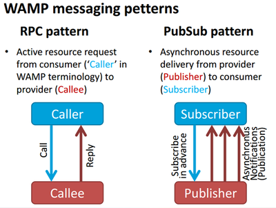
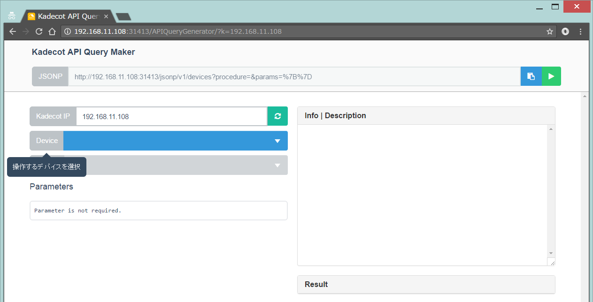
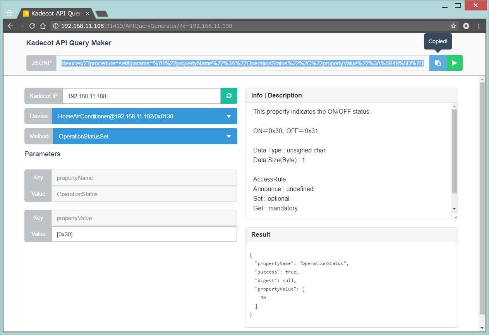
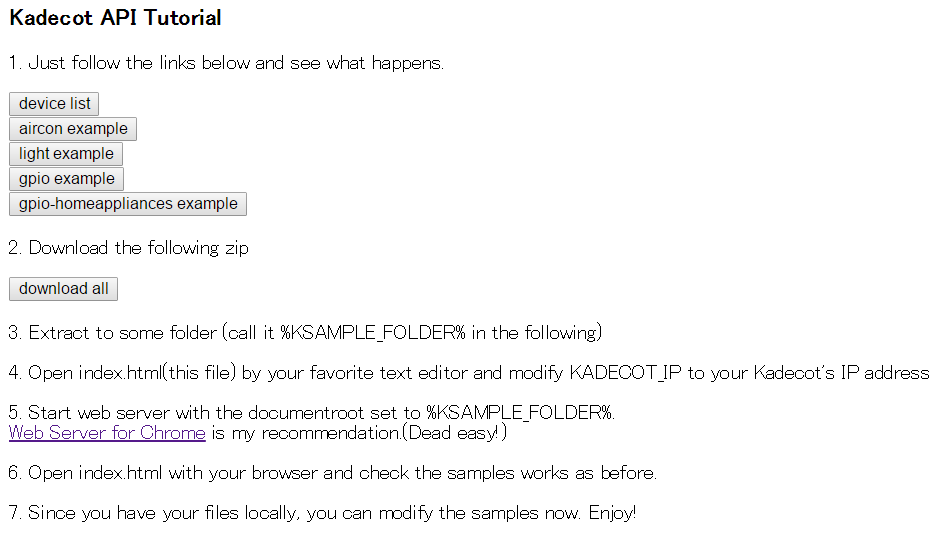

# Kadecot|JS Overview

Kadecot|JS is an open-source home gateway server implemented by Node.js + [Crossbar.io](http://crossbar.io/), runs on Raspberry pi 3 or other linux-based platforms.  
Kadecot|JS currently supports devices of [ECHONET Lite](https://echonet.jp/english/), Arduino, Generic GPIO hosted by formatted Socket/WebSocket connection, [GotAPI](http://en.device-webapi.org/) (with GotAPI gateway), and original-format online services that enables outdoor access. You can easily add more protocols if you are a Node.js programmer.  

The following video demonstrates Kadecot|JS + littleBits Arduino + ECHONET Lite air-conditioner and downlight (please click on the image.)

[](https://www.youtube.com/watch?v=RY7UgSIQQwY)  

Kadecot|JS is essentially an extensible protocol converter, from device-specific one to unified WebAPI, based on JSONP or [WAMP](http://wamp-proto.org/). WAMP is a very convenient websocket-based WebAPI backend, which supports both PubSub and RPC styled information delivery.



On top of WAMP, we added a JSON-based original payload. Through this API, you can easily access devices from major web browsers.

# Trying Kadecot|JS

### Target devices
+ If you have ECHONET Lite devices, Kadecot|JS automatically finds them and instantly enables WebAPI access.
+ If you do not have any ECHONET Lite devices, but still want to try home appliances access, you can use our [ECHONET Lite emulator](https://github.com/SonyCSL/MoekadenRoom). Note the emulator should be run on different IP address from Kadecot|JS server, because Kadecot|JS uses the same port (UDP 3610).
+ If you have Arduino (including littleBits Arduino,) you should write [this sketch](https://github.com/SonyCSL/ArduinoKadecot) into it. You may want to change contents of inPorts/outPorts arrays at the beginning of the code. You may also have to change ~/.kadecot/v1/plugins/net.kadecot.serial/ports.txt to describe which serial port(s) is connected to Arduino. Japanese instruction is [here](http://qiita.com/sgrowd/items/9ef56370a49f4f10c96c).
+ If you have CocoaBit (ESP8266 bit) developed by [wami](https://github.com/wamisnet), you should write [this sketch](https://github.com/SonyCSL/CocoaBitKadecot). You should also specify Kadecot|JS's IP address through CocoaBits's web interface. Japanese instruction is also [here](http://qiita.com/sgrowd/items/9ef56370a49f4f10c96c) (same as the previous one).
+ If you have [GotAPI](http://en.device-webapi.org/) device, you should first enable devices accessible from [GotAPI server](https://play.google.com/store/apps/details?id=org.deviceconnect.android.manager). The you can configure the GotAPI server to allow external API access. Finally you can use .kadecot/v1/tools/initGotAPI.sh to let the GotAPI server visible from Kadecot|JS.
+ If you want to connect to online services through web plugin, you can edit .kadecot/v1/plugins/net.kadecot.external/clients.json file. The documentation is under construction.

### Installation
You can install Kadecot|JS on most Linux OS by the following one-line command:

```sh
$ bash <(curl -skL https://git.io/kadecotjs-install)
```
It may take several minutes to install all necessary libraries (about 5 to 10 minutes on Raspberry Pi 3. Please be patient!)

### Running

After installation, you can boot Kadecot|JS in foreground mode by typing:

```sh
$ kadecot startfg
```

Alternatively, you can run kadecot background by:
```sh
$ kadecot start
```
In this case, you can stop or restart kadecot by:
```sh
$ kadecot stop
```
```sh
$ kadecot restart
```
The crossbar log file is stored in ~/.kadecot/logs/


Crossbar setting file exists under [.crossbar](.crossbar) directory.

## API

There are two kinds of APIs provided by Kadecot|JS.  

One is JSONP, which is very easy and flexible but only supports a part of Kadecot|JS functionalities (Actually, JSONP API is just an imcomplete frontend of the WAMP API described next.) JSONP API is simply a HTTP GET access to Kadecot server which can be performed by any system with HTTP access, such as [Sony MESH](https://first-flight.sony.com/pj/mesh), [Choregraphe for Pepper](https://community.ald.softbankrobotics.com/). This URL supports cross-domain JSONP (the callback function name should be supplied as GET 'callback' parameter.) Since this API is just an URL string, you can enshort the call by online URL enshort services such as [bit.ly](https://bitly.com/). Note that there is no security consideration. Also the URL will be changed if the device Id is changed by IP address reassignment or other devices configuration changes.  
Please use this API only for testing or Hackathon purposes. Currently, this API is hosted from HTTP port 31413.

The other is WAMP API. It allows access to full functionalities of Kadecot|JS, with account management using the [Authentication of Crossbar.io](http://crossbar.io/docs/Authentication/). You can directly access WAMP API through common WAMP libraries such as [Autobahn|JS](http://autobahn.ws/js/) with the username "guest", password "pass", port 41314, and realm "v1", but we highly recommend to use our Kadecot-specific access library (.kadecot/v1/htdocs/js/kadecot.m.js), because it provides a bit easier access. Our library can also access [Android version](https://play.google.com/store/apps/details?id=com.sonycsl.Kadecot) or [GR-Sakura version](https://dev.toppers.jp/trac_user/contrib/wiki/uKadecot) of Kadecot API by simply changing the realm to "default".

## JSONP API

There is an interactive API URL generator for JSONP API. Access `http://[Kadecot|JS IP]:31413/` to open the following tool.



You can choose your favorite device (from the blue dropdown list tagged as "Device") , and the property (function name) from the "Method" dropdown list.

You then will find the description of the selected property on the right side. Please read the description and supply desired parameters to "Parameters" boxes on bottom-left of the page (if necessary).

On top of the page, you get the URL of JSONP API command. You can press blue button to copy the entire command string, or press the green "Run" button to try API execution.



This URL can also be used for JSONP call, that allows cross-domain access from other Web Apps. The callback function name should be supplied as 'callback' key (supplied as a GET parameter).

The generated URL is a simple shortcut of the WAMP RPC call described next.   
You can further enshort the URL by using online URL enshort services such as [bit.ly](https://bitly.com/).

## WAMP API

### Samples
The easiest way to understand how WAMP API works is to see sample files that you can find by accessing `http://[Kadecot|JS IP]:31413/samples/index.html` from your web browser.

<hr />

<hr />

You can click buttons on top of the page.

### Unkind and incomplete tutorial of WAMP API
To use WAMP API, please include the Kadecot library as follows.
```html
<script src='http://[Kadecot|JS IP]:31413/js/kadecot.m.js'></script>
```

if you put your test file under `.kadecot/v1/htdocs/` directory of the Kadecot|JS server machine itself, you can utilize the Kadecot Web server functionality hosted on port 31413, and write the path shorter.

```html
<script src='/js/kadecot.m.js'></script>
```

#### Initialization

Just call `kadecot_init()` and receive the result by the Promise returned by the call.
```JS
<script>
onload = function(){
	kadecot_init().then( function(k){
		console.log( 'List all devices' ) ;
		console.log( k.devices ) ;
	}) ;
} ;
</script>
```
The kadecot library should know on which IP Kadecot|JS is running. The above example assumes the IP address (or host name) is provided as the GET parameter 'k'.
If the Kadecot|JS runs on 192.168.0.10 and the above file is stored as `.kadecot/v1/htdocs/samples/test1.html`, the file should be access as follows:

```
http://192.168.0.10:31413/samples/test1.html?k=192.168.0.10
```

If you want to explicitly supply the IP address in the code, the call becomes like this:
```JS
<script>
onload = function(){
	kadecot_init({host:'192.168.0.10'}).then( function(k){
		console.log( 'List all devices' ) ;
		console.log( k.devices ) ;
	}) ;
} ;
</script>
```
The resulting k contains three members.

+ *devices* that contains all devices found by Kadecot|JS
+ *session* that describes the connection to Kadecot|JS server
+ *querydevices* that is a function to select devices you are intesreted.

The most inportant one is *devices* that is an array of all devices. Each device contains the following members:

+ *deviceId* : an unique id number assigned by Kadecot|JS
+ *protocol* : a large classification name of devices, typically corresponds to plugin type. Eg: 'echonetlite', 'gotapi', 'serial' and so on.
+ *deviceType* : a device type ID string. Combined with *protocol*, this property uniquery identified the device type. Sometimes, different protocols may intentionally have the same deviceType to explicitly provide compatible interface. (Eg. *gpio* deviceType is implemented by either *serial* or *socket* protocols.)
+ rpc : a function to perform WAMP RPC call. Calling convention : `.rpc( PROCEDURE_STRING [, PARAMS_OBJECT])` to return Promise to get the result
+ sub : a function to perform WAMP subscribe call. Calling convention : `.sub( TOPIC_STRING , CALLBACK_FUNC [, PARAMS_OBJECT])` to return Promise to get the *subscription* object (required for unregistration).
+ unsub : a function to stop subscription. The subscription object should supplied as the argument of the call.

The list of available PROCEDURE_STRING and TOPIC_STRING is listed [here](http://app.kadecot.net/docs/ProcTopic/).

<hr />

# For developers

## Manual install of Kadecot|JS
First, clone this repository.
```sh
$ git clone https://github.com/SonyCSL/Kadecot-JS.git
```

Run install.sh and Install required tools.
```sh
$ cd ./Kadecot-JS
$ bash ./install.sh
```

Then install node libraries by hitting
```sh
$ npm install
```

## Plugin development

You can easily add new protocol by adding a custom plugin folder with index.js file and reboot. Please check the example plugin (.kadecot/v1/plugins/com.sonycsl.kadecot.test/index.js).

## Difference from Android Kadecot:

- realm (API version) is currently only 'v1' (Previously, it was 'default'
- WAMP parameters are embed in different field of wamp messages


## Boot flow (partly obsolete)
To support future API change, main logics are all under v1/ directory.
In [WAMP](http://wamp.ws) protocol, message passings are strictly isolated according to the *realm* property, declared when WAMP client is connected to the WAMP router. We use realm to switch API version.

In [main.js](main.js), a web server and a version-specific provider ([v1/provider.js](v1/provider.js) ) is started.
Currently the web server is only used for wamp client sample, but in future, default system manager will be hosted.

[v1/provider.js](v1/provider.js) tries to connect to WAMP router. If successful, it registers a Kadecot-specific public WAMP procedure (*getDeviceList*) and some used for plugin registration (*registerplugin*,*registerdevice*,*unregisterdevice*), and subscribes to crossbar-specific topic *wamp.session.on_leave*, to monitor plugin detachment.
After this, plugins under [v1/plugins/](v1/plugins/) are scanned and inited.

During plugin initialization, each plugin is also connected to WAMP router. This connection is notified to the provider by calling WAMP procedure *com.sonycsl.kadecot.provider.procedure.registerplugin* with desired plugin prefix declared.

[v1/provider.js](v1/provider.js) also starts a little web server on port 31413 to host sample app (sample.html).
sample.html assums there is one ECHONET Lite Air-conditioner exists.

Try these by accessing http://[host]:31413/sample.html

## Other versions and related systems

Currently, this Node.js version only supports ECHONET Lite and [Device WebAPI (GotAPI)](http://en.device-webapi.org/), while the [Android version](https://play.google.com/store/apps/details?id=com.sonycsl.Kadecot) additionally supports Sony's Bravia, IRKit, Hue, and by adding an [external plugin](https://github.com/SonyCSL/LightblueBeanPlugin), LightBlue Bean can also be accessed. If you use the Android version, please use our library (Rather than Autobahn) to access it as described in [this page](http://kadecot.net/English/).

[Device WebAPI (GotAPI)](http://en.device-webapi.org/) is another device WebAPI server managed by Device WebAPI consortium. It runs on smartphones and supports various devices including smart glasses, watches, and so on. If you want to communicate with those devices through Kadecot API, you need to run [Device WebAPI Manager App](https://play.google.com/store/apps/details?id=org.deviceconnect.android.manager) on android phone within the same network, and set the IP address to Kadecot|JS config. Please check below.

## Dependencies

This application uses [crossbar.io](http://crossbar.io/docs/Installation-on-CentOS-and-RedHat/) and [Autobahn|js](http://autobahn.ws/js/) as [WAMP](http://wamp.ws) stack. Also uses [node-echonet-lite](https://www.npmjs.com/package/node-echonet-lite) in echonet lite plugin.

## Test tools
- [MoekadenRoom](http://kadecot.net/blog/1479/) : ECHONET Lite device emulator (Run this on different IP from Kadecot)
- [Kadecot for Android](https://play.google.com/store/apps/details?id=com.sonycsl.Kadecot)

## Licenses

### GNU AGPL 3.0
-<a href="http://crossbar.io/" target="_blank">Crossbar.io</a>

### MIT

- <a href="https://github.com/SonyCSL/Kadecot-JS" target="_blank">Kadecot|JS</a>
- <a href="https://jquery.com/" target="_blank">JQuery</a>
- <a href="http://autobahn.ws/js/" target="_blank">Autobahn|JS</a>
- <a href="https://github.com/futomi/node-echonet-lite" target="_blank">node-echonet-lite</a>
- <a href="https://www.npmjs.com/package/cosmiconfig" target="_blank">cosmiconfig</a>
- <a href="https://github.com/mzabriskie/axios" target="_blank">axios</a>
- <a href="https://github.com/lodash/lodash" target="_blank">lodash</a>
- <a href="https://www.npmjs.com/package/serialport" target="_blank">serialport</a>
- <a href="https://github.com/postcss/postcss-js" target="_blank">postcss-js</a>
- <a href="https://github.com/postcss/postcss-import" target="_blank">postcss-import</a>
- <a href="https://github.com/postcss/postcss-url" target="_blank">postcss-url</a>
- <a href="https://github.com/MoOx/postcss-cssnext" target="_blank">postcss-cssnext</a>
- <a href="https://github.com/postcss/postcss-reporter" target="_blank">postcss-reporter</a>

### Apache 2
- <a href="https://github.com/theturtle32/WebSocket-Node" target="_blank">WebSocket-Node</a>
- <a href="https://github.com/nomiddlename/log4js-node" target="_blank">log4js</a>

## Acknowledgements
- [Futomi Hatano](https://github.com/futomi) helped me a lot to quickly modify his [node-echonet-lite library](https://www.npmjs.com/package/node-echonet-lite) to match my request. Thank you very much!!
