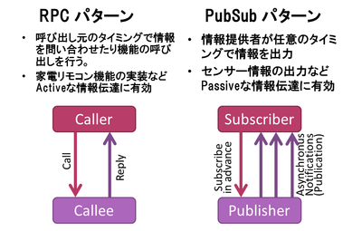
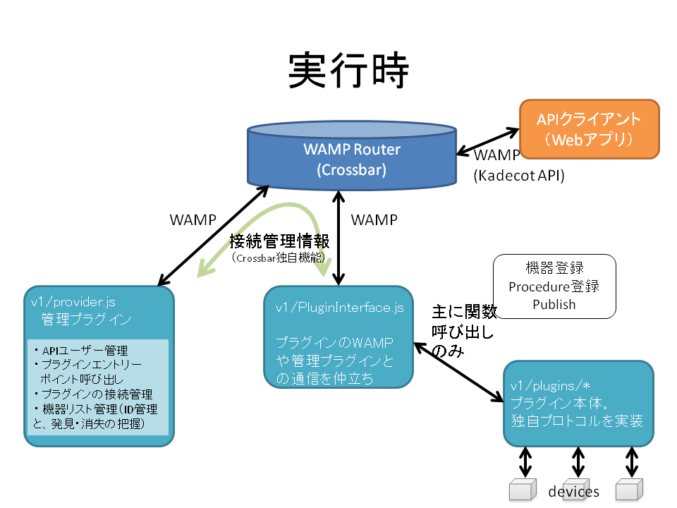
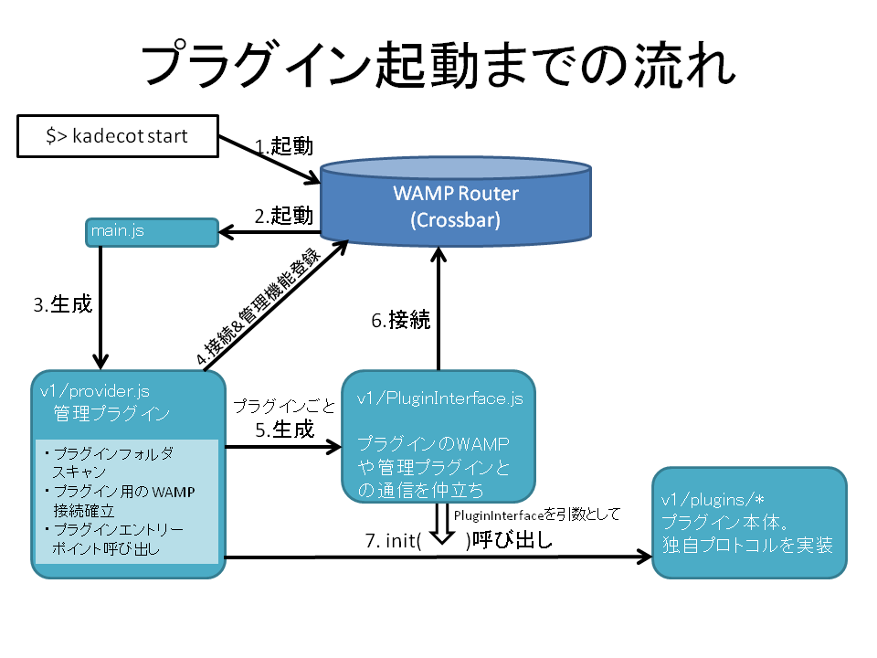

# Plugin Development Information

プラグインの仕組みと作り方について解説します。

プラグインとはKadecot|JS (以下Kadecot) の中心的な機能を提供する部分です。つまり、機器ごとに異なるプロトコルをWAMPに変換し、Kadecot APIの体系で使えるようにします。以下、プラグインの動作と作り方について説明しますが、WAMPに関する基本的概念(Procedure文字列を用いたRPC、Topic文字列を用いたPubSub)については既知とします。



## サンプルプラグイン

**$(HOME)/.kadecot/v1/plugins/net.kadecot.test/index.sample.js**

はサンプルプラグインのソースです。
このファイルをindex.jsにリネームし、Kadecotをrestartすると動くので試してみてください。

このプラグイン内では、TestObjectという機器オブジェクトを登録し、その中で

**net.kadecot.test.procedure.TestProcedure**

というProcedureと、

**net.kadecot.test.topic.TestTopic**

というTopicを実装しています。KadecotのControl Panel(ポート31413)を開くと、TestObjectという機器が登録されていることがわかると思います。Topicには３秒おきに100回（５分間）Publishされ、そののちにTestObjectのstatusがfalseになります（機器情報そのものが削除されるわけではありません）。

プラグインの機能は、機器の登録と削除、ProcedureとTopicの定義ですので、このサンプルには全て含まれていることになります。

## プラグインの実行

プラグインは直接WAMPのアクセスを行ったりセッション情報を管理プラグインに送ったりすることはなく、常にPluginInterfaceオブジェクトを介して行います。下図「接続管理情報」とは、Kadecotで用いているWAMP RooterであるCrossbarの独自機能を用いた、プラグインの接続状況に関する情報などです。



## プラグインの書き方

サンプルプラグインを参考にしながら、プラグインの書き方を解説します。

まず、プラグインはKadecot起動時に.kadecot/v1/pluginsの下のディレクトリをスキャンすることで行われます。フォルダの下にindex.jsがあればこのファイルがエントリーポイントになります。index.jsがなければプラグインにはなりません。このスキャンは起動時にしか行われないので、新たなプラグインを追加したらKadecotのrestartが必要です。

ディレクトリ名は**Prefix**と呼び、重要な意味があります。プラグインが実現するProcedureやTopicは、必ずこの名前からはじまることになります。名前の衝突を避けるため、お持ちのドメイン名を逆に並べてお使いください。Sony CSLではcom.sonycsl.kadecotとnet.kadecotからはじまるもののみ作っています。（com.sonycsl.kadecotはAndroid版との互換性のために使っているもので、ゆくゆくはAndroid版と同時にnet.kadecotに一本化したいと思っています）

サンプルプラグインのソースは次のようになっています。

```JS
//////////////////////////////////////
// Exports

var pluginInterface ;

exports.init = function() {
    pluginInterface = this ;

    pluginInterface.registerDevice(
	    // uuid,deviceType,description,nickname,onregisteredfunc
    	'TestObject', 'TestObject', 'Only one test object', 'TestObject')
      .then( re => {
      	pluginInterface.log('Device registration result:'+JSON.stringify(re)) ;

        pluginInterface.registerProcedures([{
          name: 'TestProcedure',
          procedure: (uuidArray, argObj) => {
            pluginInterface.log('proc TestProcedure call:' + JSON.stringify(uuidArray));
            return { 'message': 'Nothing happened.' };
          }
        }]);

        var count = 0 ;
        var timerid = setInterval( ()=>{
        	if( ++count == 101){
        		clearInterval(timerid) ;
	        	pluginInterface.unregisterDevice( "TestObject") ;
        	}
        	pluginInterface.publish( "TestTopic",["TestObject"],
            	{message:'Dummy publication from TestObject'}) ;
        },3000) ;
      }
    );
} ;

```

#### エントリーポイント
まず、init関数をexportします。初期化時にKadecotから呼び出されます。
thisとして、Kadecot本体とやりとりするためのオブジェクトが渡されますので、一応変数（pluginInterface）で受けておきます。

```JS
exports.init = function() {
    pluginInterface = this ;
```

#### registerDevice : 機器の登録

機器を登録したい時はpluginInterface.registerDevice()という関数を呼び出します。init後であれば、任意のタイミングで呼び出し可です。
```JS
    pluginInterface.registerDevice(
	    // uuid,deviceType,description,nickname
    	'TestObject', 'TestObject', 'Only one test object', 'TestObject')
              .then( re => {
```
この関数には引数が４つ必要です。返り値は、登録完了時にトリガーされるPromiseです。.then節で受けてください。
+ uuid : Kadecot内部で同一性判定に用いる、唯一の機器ID文字列。できればいつ、どのような状況で機器登録する場合も、ハードウェアが同じであれば同じ値になるとベストです。ネットを使う機器の場合は、Macアドレスなんかにするといいかもしれません。
+ deviceType : 機器の種類を表す文字列。プロトコル内に、API体系(ProcedureやTopicの名前や個数など)が違う機器が混在する場合、このdeviceTypeで区別してください。例えば、echonetliteプラグインでは、機器の種類ごとに異なるdeviceTypeが割り当てられています。サンプルではuuidと同じ値になっていますが、違う値にしても問題ありません。
+ description : 機器を説明する文章です。あまり重要ではありません。
+ nickname : ユーザーが機器を認識しやすくするための名前文字列。例えば「リビングの照明」など。サンプルではuuidと同じ値になっていますが、違う値にしても問題ありません。

#### registerProcedures : Procedureの登録

APIクライアントからの呼び出しに応答するために用いるProcedureの登録を行います。
pluginInterface.registerProcedures()の引数は配列で、複数のProcedureを同時に登録できます。
配列の各要素はnameとprocedureの２つの要素を持つオブジェクトで、TestProcedureでは以下のように定義されています。

```JS
{
  name: 'TestProcedure',
  procedure: (uuidArray, argObj) => {
    pluginInterface.log('proc TestProcedure call:' + JSON.stringify(uuidArray));
    return { 'message': 'Nothing happened.' };
  }
}
```

このように、nameはProcedure名、procedureは引数を二つ持つ関数です。  
APIクライアントから見ると、nameの先頭にプレフィックス（プラグインが入っているディレクトリ名）と、".procedure."が付与された文字列になりますので、

net.kadecot.test.procedure.TestProcedure

というProcedureが定義されることになります。(net.kadecot.externalだけは複数のオンラインプラグインを束ねる役割のため、例外的に少し異なる変換規則になります。)
処理の中身はprocedureで定義される関数の中で書きます。ここではJSONオブジェクトをreturnしていますので、即座にこのオブジェクトがAPIクライアントに返されます。このオブジェクトの中身は自由です。

返答を作るのに時間がかかる場合は、Promiseを返すこともできます。この場合は次のようになるでしょう。

```JS
  procedure: (uuidArray, argObj) => {
    return new Promise( (accept,reject)=>{
    	// 時間がかかる処理
	    accept( { 'message': 'Nothing happened.' } );
    } ) ;
  }
```

#### publish : トピックへのPublish

Publishしたい場合は事前の登録など必要ありません。Publishしたいタイミングで以下のようなコールをしてください。

```JS
pluginInterface.publish( "TestTopic",["TestObject"],
	{message:'Dummy publication from TestObject'}) ;
```
一つ目の引数はtopic名です。APIクライアントから見ると、先頭にプレフィックスと".topic."という文字列が足されますので、結局

net.kadecot.test.topic.TestTopic

というTopicにSubscribeしているAPIクライアントに値が配信されます。(procedureと同様、net.kadecot.externalだけは例外的に少し異なる変換規則になります。)

二つ目の引数は配列で、送信元のデバイスのuuid (機器登録時に設定したもの。文字列) を要素に持ちます。
配列にはなっていますが、複数デバイスからの同時Publishは、試したことがないのでやめておいた方が無難です。

三つめの引数は、APIクライアントに送信したい情報本体です。フォーマットは自由です。

#### unregisterDevice : 機器の削除
pluginInterface.unregisterDeviceは機器の削除を行います。引数に、登録時に指定したUUIDを入れて呼び出してください。

```JS
pluginInterface.unregisterDevice( "TestObject") ;
```

プラグインの作り方は以上です。

# Kadecotブートの流れ



Kadecotはcrossbarのゲストプロセスとして立ち上げられます。[.crossbar/config.json](.crossbar/config.json)の一番下にその設定が書いてあります。
まず[main.js](main.js)が起動し、ここはラッパーで、そこから呼び出される管理プラグイン[v1/provider.js](v1/provider.js)がメインロジックです。このv1というのは、現在用いているRealmを表しています。将来的にAPIがバージョンアップした場合、v1はそのまま生かして新たな部分を追加していくためにこうしています。ただし、実際にはv1内でもユーザー管理のために、さらに細かくRealmを分けています。詳しくは後述しますが、このサブRealmの名前はv1.0とかv1.1とか、ドットで区切って数字を追加することにしています。CrossbarではRealmは動的に追加できないらしいので、.crossbar/config.jsonにあらかじめ定義してあります。
デフォルトだとデフォルトユーザー用のv1.0だけ追加されています。増やすには、[v1/tools/genAccounts.sh](v1/tools/genAccounts.sh)を使うことができます。

#### 管理プラグインの接続

管理プラグイン[provider.js](v1/provider.js)は他のプラグインの管理をするのが主な役割です。それ以外に、JSONPサーバの立ち上げも行います。JSONPサーバの実体は[v1/JSONPRouter.js](v1/JSONPRouter.js)にありますが、本ドキュメントでは説明しません。単なる普通のWAMP APIクライアントのRPCコールのラッパーを提供しているだけです。

管理プラグインは最初に**スーパーユーザー**としてCrossbarに接続します。認証には[CrossbarのAuthentication機能](http://crossbar.io/docs/Authentication/)を用いています。WAMPそのものにも認証機能があるようですが、どこまでがWAMP標準機能で、どこがCrossbar独自機能なのかはわかりません。すみません。
いずれにせよCrossbarのAuthentication機能は、ユーザーを認証するための４つの方法を提供しています。スーパーユーザーはstaticなWAMP-Ticketによる認証で、ユーザー名（Crossbarの用語でいえばrole）はsuperuser、パスワードは起動時に動的に生成されます。[kadecot](kadecot)という起動スクリプトの中にROOTPASSという環境変数を生成しているところがあります。これをCrossbarと管理プラグインの双方で取得し、superuserのパスワードとして用います。

APIクライアント（一般ユーザー）やプラグインはDynamicなWAMP-CRA認証です。他のクライアントが接続してきたときにその認証情報が正しいかどうかの確認も管理プラグインが行います（この認証は、常にRealm v1で行います）。そこで、スーパーユーザーがCrossbarに接続したら、このKadecotに接続可能なユーザー一覧（アカウント情報）を取得します。アカウント情報は[users.json](users.json)に書かれています。

[CrossbarのAuthentication機能](http://crossbar.io/docs/Authentication/)では、様々なprocedureのcallやregister、topicのsubscribeとpublishが可能かどうか、それぞれ認可レベルを細かく設定することができます。スーパーユーザーは全てのprocedure,topicへの自由なアクセス権限を持ちます。他のユーザーはCrossbarから提供される管理機能（wamp.からはじまるもの）のprocedure,topic には一切アクセスできず、さらにKadecotで提供される管理機能（admin.からはじまるもの）も、procedureはcallだけ許可、topicは一切アクセス不可になっています。ただし例外的に、機器の変更通知を受け取るためのadmin.ondevicechangedというtopicのみsubscribe可です。このあたりの設定は、全て[.crossbar/config.json](.crossbar/config.json)の中に書いてあります。

#### 管理プラグインが実装しているProcedure

管理プラグインは、ユーザー認証機能を実装するとともに、以下のprocedureを実装します。

**com.sonycsl.kadecot.provider.procedure.getDeviceList**

APIクライアントからの要求に応じてデバイス一覧を提供するためのものです。互換性のために昔と同じprocedure名になっていますが、本当はadmin.devicelistとかにしたいところです。

**admin.registerplugin**

プラグインがCrossbarに接続したときに、その接続情報をプラグインから教えてもらうためのものです。
もし、このprocedure呼び出し時にプラグインから渡ってくるprefix(ディレクトリ名)が、実際にないものだった場合はwamp.session.killというCrossbar独自procedureにより、このプラグインを切り離します。

**admin.registerdevice**

プラグインでデバイスが見つかった時に、その情報をプラグインから教えてもらうためのものです。

**admin.unregisterdevice**

プラグインでデバイスが削除された時に、その通知をプラグインから受け取るためのものです。

また、機器構成が変わったことを検知したときには、次のtopicにそのことをpublishします。

**admin.ondevicechanged**

さらに、プラグインセッション（プラグインとCrossbarとの接続）が何らかの原因により切れたことを検知するために、以下のCrossbar独自topicにsubscribeします。

**wamp.session.on_leave**


#### 実行時


##### Realmによるユーザーへの機能切り分け（実装中）

管理プラグインは、定義されているすべてのRealmに接続し、上記の処理を行います。実はKadecotは最初からマルチユーザーに対応しており、ログイン時のアカウントに応じて別のRealmに接続を転送します。管理プラグインだけでなく、次に説明する各デバイスプラグインも同様です。この機能は、Realmごとに違う構成のプラグインを接続し、APIクライアントに対して公開する機能を柔軟に切り替えるためのものです。
ただし、この機能は未完成であり、接続するプラグインをRealmごとに変化させるためのUIもありません。将来課題です。

#### プラグインの起動と接続

認証の設定や管理用Procedureの登録が終わったら、いよいよプラグインのための接続を確立します。[provider.js](v1/provider.js)内connect_plugins()の中でその処理を行っています。プラグインフォルダ内をスキャンし、見つけたディレクトリごとに、Crossbarへの接続を試みます。この時の認証は一般ユーザーとして行いますので、権限も限られています。
なお、この時点ではプラグイン本体である各index.jsの呼び出しはまだです。

#### セッション確立後の処理

セッションが確立したら、PluginInterfaceオブジェクトを作ります。この時の処理は、[v1/plugin-interface.js](v1/plugin-interface.js)に書かれています。

まず、プラグインのための接続が成功したこと自体を管理プラグインに通知するために、admin.registerpluginを呼び出します。もしこのときまでにすでにデバイスが見つかっている場合はadmin.registerdeviceを、さらに登録したいprocedureがある場合はその登録も行います。実際には最初の接続時にすでにデバイスが見つかっているようなことは稀ですが、一旦管理プラグインとの接続が切れ、その後再接続できた場合などに、既知のデバイスやprocedureが存在することがあり、迅速に復帰することができます。

PluginInterface内の残りの処理としては、様々なプラグインから使われる共通の関数、registerDevice(), unregisterDevice(), registerProcedures(), publish()を作ります。

PluginInterfaceができあがったら、それを引数としてディレクトリ内index.jsを起動します。
プラグイン内ではPluginInterfaceを介して機器登録やprocedure/topicなどの処理を記述します。本ドキュメント最初の方でご説明したとおりです。

## 他のWAMPルータに入れ替えるには

Kadecotの実装の大部分はプラグインです。Crossbarは高機能で使いやすいのですが、Pythonで実装されていることもあり、利用が難しいこともあるでしょう。ここだけ他のルータに入れ替えたいと思う方もいるかもしれません。また、折角プラグインとルータの間の通信もWAMPなので、プラグインとルータが別サーバ上で実装されていてもよいのではと考える方もいるでしょう。プラグインの実装を変えずにそういったことが実現できれば便利です。以下、そうするにはどうしたらいいか、想像ベースでメモしてみます。

一番簡単にそれを実現するには、PluginInterfaceを入れ替えるのがよいです。プラグイン本体が直接Kadecotの管理機能やWAMPコールを発行することはなく、PluginInterfaceのregisterDevice(), unregisterDevice(), registerProcedures(), publish()を介して機能を定義しています。それから、プラグイン起動時に、エントリーポイントであるinit()を呼んでください。
プラグインの中には、外部からファイルを読み込むものもありますので（例えばv1/plugins/net.kadecot.serial/ports.txtなど）、プラグインが存在する相対パスは合わせておいた方が無難でしょう。

このアプローチを取れば、Kadecotのプラグインを他のシステムで用いることができるでしょう。しかし、認証機能やRealmは、別のルータであればたいてい別の設定が必要でしょう。この部分も合わせることで、アプリの乗り入れも可能になります。Kadecotはそもそも、様々なアプリを作るためのプラットフォームを作りたいという動機で開発されています。アプリを共通にする、すなわちAPI互換があれば大変メリットが大きいでしょう。

net.kadecot.externalに関しては、他のプラグインとは異なる部分がありますのでご注意ください。このプラグインは、同じディレクトリ内にあるclients.jsonを読み、それに従ってネット上の別のプロセスと通信をする機能を持っています。このプロセス向けに、APIのブリッジをする機能もあり、別のプロセスの肩代わりをしてルータに接続することができます。つまり、このプラグインに限っては、プラグインとしての顔と、(複数の)APIクライアントとしての顔があり、いくつもの接続をルータとの間に確立します。

もし現在の管理プラグインの機能も別ルータに移植したい場合は、wamp.*やadmin.*の機能を実装する必要があるでしょう。この部分は基本的に普通のWAMPのRPC,PubSubのフレームワークで実現されています。ただ、クライアントごとに認可を細かく設定する方法はルータによってかなり異なるはずです。また、現在の管理プラグインでは、各プラグインの接続を管理するためにsessionidをやり取りしている部分があり、これはプラグインが外れてしまった場合やパーミッション管理のために使っています。これもルータによって取り扱いが異なる部分かと思います。

もし困難を感じた場合は、できる範囲でサポートしますので、GitHubの[Issues](https://github.com/SonyCSL/Kadecot-JS/issues)に投げていただけば幸いです。
